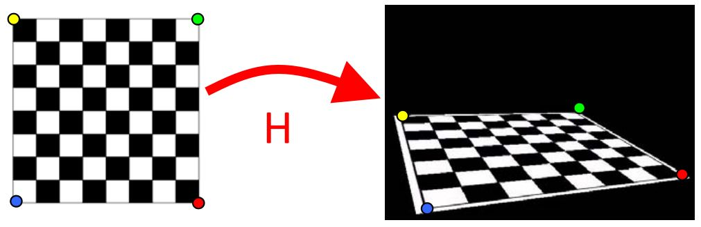
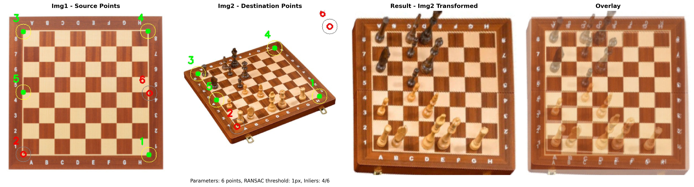
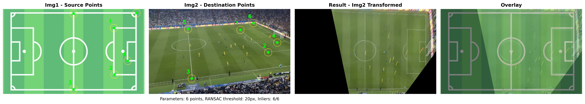
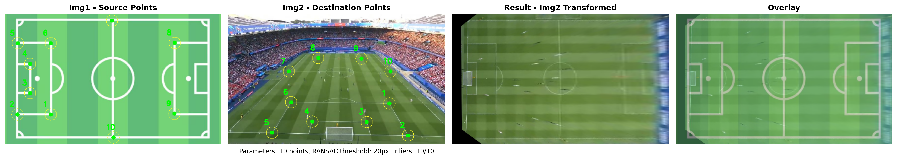

<div align="center">
<h1 align="center">Homography Point Selector Application</h1>

  <p align="center">
    Interactive tool for homography transformation experiments using OpenCV
  </p>

</div>

## Overview

Homography is a fundamental computer vision technique that relates corresponding points between two views of the same planar surface. This interactive application lets you manually select correspondence points to experiment with homography transformations and observe their effects in real-time. While real-world applications typically use automatic feature detection algorithms (SIFT, ORB, Harris corners), manual selection provides better insight into how point correspondences affect geometric transformations.

<p align="center">
  
</p>

For detailed mathematical foundations and comprehensive analysis of homography transformations, refer to the complete article: [📰 Homography Transformations in Practice](https://medium.com/wanabilini/homography-transformations-in-practice-974c9e2730b2)

## Code Execution

### Basic Launch
```bash
# Simple
python homographyapp.py image1.jpg image2.jpg
# Advanced Options
python homographyapp.py image1.jpg image2.jpg --display-scale 0.5 --num-points 6 --ransac-threshold 3
```

**Parameters:**
- `--display-scale, -s`: Image scale factor (0.1-1.0, default: 1.0)
- `--num-points, -n`: Number of correspondence points (minimum 4, default: 4)
- `--ransac-threshold, -r`: RANSAC threshold in pixels (1-20, default: 5)

### How to Use


<p align="center"><i>Interactive homography application interface showing real-time point manipulation and transformation</i></p>

1. **Place Points**: Click and drag correspondence points on both images
2. **Adjust RANSAC**: Use the slider to change threshold (1-20 pixels) and control algorithm tolerance
3. **Observe Results**: 
   - Green points = inliers (used by RANSAC)
   - Red points = outliers (rejected by RANSAC)
   - The application transforms Img2 to match Img1's perspective
4. **Save Results**: Press 's' to save composite image as `{img1_name}_{img2_name}_homography_exemple.png`
5. **Reset**: Press 'r' to reset points
6. **Quit**: Press 'q' to exit

### Interface Windows

- **Img1 - Source Points**: Reference image with correspondence points
- **Img2 - Destination Points**: Image to be transformed with correspondence points  
- **Result - Img02 Transformed**: Img2 transformed to match Img1's perspective
- **Overlay**: Superposition showing transformation alignment quality
- **Homography Matrix**: Real-time 3x3 transformation matrix
- **RANSAC Controls**: Statistics and threshold slider

## Example Results

The following demonstrations showcase practical applications of homography transformations across different scenarios.
<p align="center">
  
</p>
<p align="center">
  
</p>
<p align="center">
  
</p>
<p align="center">
  
</p>
<p align="center">
  
</p>

## Contact

If you have any questions or would like to connect:

- 📬 Email me at [mlachahe.saidsalimo@gmail.com](mailto:mlachahe.saidsalimo@gmail.com)
- 🟦 Connect with me on [LinkedIn](https://www.linkedin.com/in/mlachahesaidsalimo/)
- ⬛ Read my thoughts on [Medium](https://medium.com/@mlachahesaidsalimo)
